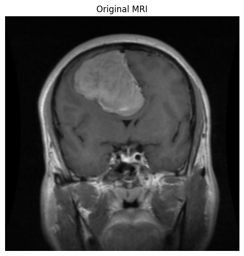
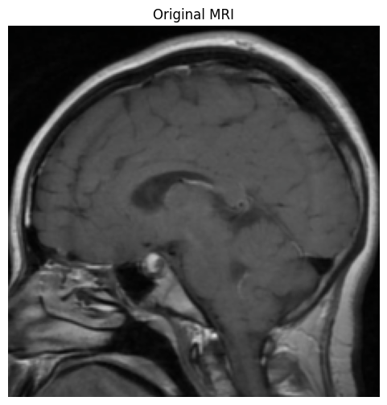
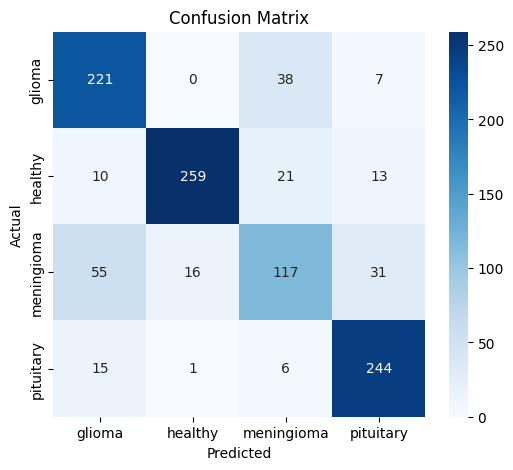
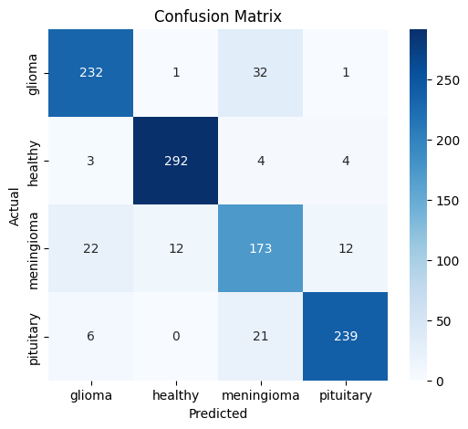

# Brain Tumor MRI Classification with Explainable AI

This project explores the use of deep learning models for brain tumor classification using MRI scans. A custom Convolutional Neural Network (CNN) was developed from scratch and compared against a DenseNet121 transfer learning approach. Explainable AI techniques were implemented using Grad-CAM to visualize the image regions influencing model predictions.

The goal of this project is not only to achieve accurate classification performance, but also to improve model interpretability by understanding how deep learning models analyze medical images.

---

## Project Overview

Brain tumor detection from MRI scans is a challenging medical imaging task where interpretability is important. This project implements and compares:

- Custom CNN architecture built from scratch
- DenseNet121 transfer learning model
- Image preprocessing and augmentation pipeline
- Model evaluation using classification metrics
- Grad-CAM explainability for visual interpretation

---

## Models

## Custom CNN

A custom Convolutional Neural Network was developed from scratch using PyTorch to classify MRI scans without relying on pretrained weights. The architecture was designed to progressively extract spatial features from MRI images using convolution, activation, and pooling operations before classification.

### Architecture Summary

- **Input:** RGB MRI image with 3 channels (224×224 resolution)
- **Convolutional Layer 1:** 3 input channels → 8 output channels, 3×3 kernel
- **Convolutional Layer 2:** 8 input channels → 16 output channels, 3×3 kernel
- **Convolutional Layer 3:** 16 input channels → 32 output channels, 3×3 kernel
- **Activation Function:** ReLU after each convolutional layer
- **Pooling:** 2×2 max pooling after each convolutional layer
- **Fully Connected Layer 1:** 32 × 27 × 27 input features → 500 neurons
- **Fully Connected Layer 2:** 500 neurons → 4 output classes

**Classes:** Glioma, Meningioma, Pituitary, Healthy

### Training Configuration

- **Epochs:** 10
- **Learning Rate:** 1 × 10⁻⁴
- **Weight Decay:** 1 × 10⁻⁴
- **Optimizer:** Adam
- **Batch Size:** 32
- **Loss Function:** Cross Entropy Loss
- **Hardware:** NVIDIA T4 GPU with CUDA acceleration

---

## DenseNet121 Transfer Learning

A pretrained DenseNet121 model was fine-tuned using transfer learning. The convolutional feature extraction layers were frozen while a custom classifier was trained for brain tumor classification.

### Architecture Summary

- **Base Model:** Pretrained DenseNet121
- **Transfer Learning:** Frozen feature extraction layers
- **Classifier Layer 1:** DenseNet features → 256 neurons
- **Activation:** ReLU
- **Dropout:** 0.25
- **Classifier Layer 2:** 256 neurons → 4 classes
- **Output Activation:** LogSoftmax

**Classes:** Glioma, Meningioma, Pituitary, Healthy

### Training Configuration

- **Epochs:** 10
- **Learning Rate:** 1 × 10⁻³
- **Weight Decay:** 1 × 10⁻⁴
- **Optimizer:** Adam
- **Batch Size:** 32
- **Loss Function:** Negative Log Likelihood Loss
- **Hardware:** NVIDIA T4 GPU with CUDA acceleration

---

## Evaluation Metrics

Models were evaluated using:

- **Accuracy:** Overall percentage of correctly classified MRI scans
- **Precision:** Percentage of predictions for a class that were correct
- **Recall:** Percentage of actual samples correctly identified
- **F1-Score:** Balance between precision and recall

---

## Explainable AI (Grad-CAM)

Grad-CAM was used to visualize which regions of an MRI scan contributed most to the model prediction.

The process involves:

1. Computing gradients of the predicted class with respect to convolutional feature maps
2. Applying global average pooling to calculate feature importance weights
3. Combining weighted feature maps into a heatmap
4. Overlaying the heatmap on the MRI image

---

## Grad-CAM Visualization Results

### Example 1

| Original MRI | Grad-CAM Heatmap |
|---|---|
|  |  |

### Example 2

| Original MRI | Grad-CAM Heatmap |
|---|---|
|  |  |

### Example 3

| Original MRI | Grad-CAM Heatmap |
|---|---|
|  |  |

---

## Results

DenseNet121 improved overall classification performance compared to the custom CNN, increasing test accuracy from **79% to 88%** and weighted F1-score from **0.79 to 0.89**.

### Confusion Matrices

| Custom CNN | DenseNet121 Transfer Learning |
|---|---|
|  |  |

---

### Custom CNN Performance

| Class | Precision | Recall | F1-Score |
|---|---|---|---|
| Glioma | 0.73 | 0.83 | 0.78 |
| Healthy | 0.94 | 0.85 | 0.89 |
| Meningioma | 0.64 | 0.53 | 0.58 |
| Pituitary | 0.83 | 0.92 | 0.87 |
| **Weighted Avg** | **0.80** | **0.80** | **0.79** |

### DenseNet121 Performance

| Class | Precision | Recall | F1-Score |
|---|---|---|---|
| Glioma | 0.88 | 0.87 | 0.88 |
| Healthy | 0.96 | 0.96 | 0.96 |
| Meningioma | 0.75 | 0.79 | 0.77 |
| Pituitary | 0.93 | 0.90 | 0.92 |
| **Weighted Avg** | **0.89** | **0.89** | **0.89** |

---

## Performance Analysis

The custom CNN struggled most with the **meningioma tumor class**, achieving an F1-score of **0.58** due to lower recall.

DenseNet121 significantly improved meningioma classification:

- Precision: **0.64 → 0.75**
- Recall: **0.53 → 0.79**
- F1-Score: **0.58 → 0.77**

The Healthy class also improved significantly. Precision increased from **0.94 to 0.96**, meaning that when DenseNet121 predicted an MRI scan as healthy, it was correct 96% of the time, reducing tumor scans incorrectly classified as healthy.

Healthy recall improved from **0.85 to 0.96**, showing stronger identification of true healthy MRI scans.

Overall, DenseNet121 demonstrated stronger feature extraction and improved reliability across MRI categories.

---

## Technologies Used

- Python
- PyTorch
- TorchVision
- DenseNet121
- Grad-CAM
- NumPy
- Pandas
- Matplotlib
- Scikit-learn
- Jupyter Notebook
- LaTeX

---

## Future Improvements

- Explore additional XAI techniques such as Integrated Gradients and Score-CAM
- Improve tumor localization with segmentation approaches
- Experiment with Vision Transformers
- Evaluate on larger MRI datasets

---

## Author

**Brendan Lauterborn**

MS Computer Science  
Deep Learning / Computer Vision Project